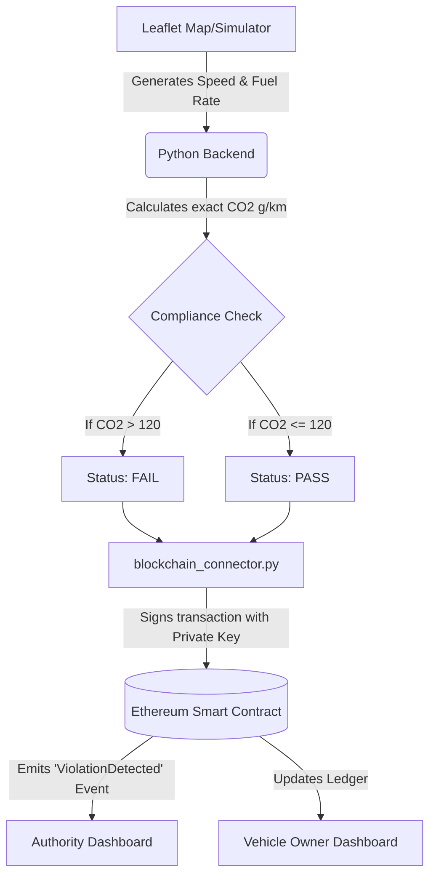

# Blockchain-Based Real-Time Vehicle Emission Monitoring & Compliance System (Smart PUC)
**A Comprehensive Project Report & Technical Guide**

---

## 1. Project Working (End-to-End Flow)

The Smart PUC system replaces the outdated, manual "Pollution Under Control" testing with a continuous, tamper-proof, blockchain-based system. 

The entire system operates in a highly orchestrated loop: **Simulation → Engine → Blockchain → Interface**.

### Step-by-Step Data Flow



1. **Simulation (Frontend):** A virtual car drives along real Mumbai roads (fetched via OSRM) on a map. Every 3 seconds, it records its speed and theoretical fuel consumption based on traffic heuristics.
2. **Backend Processing (Python):** The frontend sends this data to the Flask REST API. The Python engine calculates the precise CO₂ emissions using standard chemical formulas (e.g., *1L of petrol = 2310g of CO₂*).
3. **Blockchain Interaction:** The Python server uses `Web3.py` to cryptographically sign a transaction and send the calculated CO₂ value to the Ethereum network.
4. **Smart Contract Storage:** The Solidity Smart Contract receives the data, permanently saves it to the ledger, and instantly alerts the network if the car failed the emission test.
5. **Frontend Display:** The web dashboards constantly read the blockchain. When a new record is saved by the Python backend, the UI updates automatically to show the real-time compliance status to both the Vehicle Owner and the Regulatory Authority.

---

## 2. Why Multiple Terminals Are Used

When running the project natively, you will notice exactly three terminal windows operating simultaneously. This is because modern Decentralized Applications (DApps) consist of three completely distinct architectural layers that must talk to each other over network ports:

1. **Terminal 1: Ganache (Port 7545)**
   This is the *Database / Network Foundation*. Blockchain nodes must run continuously to process and mine transactions. If this terminal closes, the blockchain dies.
2. **Terminal 2: Python Backend (Port 5000)**
   This is the *Brain*. It acts as the vehicle's IoT computer. It patiently waits for simulated telemetry data, performs the heavy mathematical CO₂ calculations, and securely signs the blockchain transactions.
3. **Terminal 3: Frontend Server (Port 8080)**
   This is the *Presentation Layer*. It serves the HTML, CSS, and JavaScript files to your web browser so you can visually interact with the map, dashboards, and MetaMask. 

---

## 3. Local Blockchain Environment

> [!NOTE]
> Public blockchains (like the real Ethereum Mainnet) cost real money (gas fees) to use. To develop and test for free, we use a localized simulation.

* **Where it is setup:** The local blockchain is hosted entirely in your computer's RAM via a tool called **Ganache**. 
* **Role of Ganache:** Ganache is a personal, localized Ethereum blockchain. It provides you with 10 fake accounts, pre-funded with 1000 fake ETH each, allowing you to instantly process transactions without waiting for global miners.
* **Role of Truffle:** Truffle is the development framework. It compiles our human-readable smart contract code into machine bytecode, and then "migrates" (deploys) that bytecode onto the Ganache blockchain. 

---

## 4. Smart Contract & Solidity Explanation

### Where is it located?
The core logic resides in a single file: `contracts/EmissionContract.sol`.

### What is Solidity?
Solidity is an object-oriented programming language specifically designed for writing Smart Contracts on the Ethereum platform. It determines the strict rules of how data is added to the blockchain.

### How do Smart Contracts Work?
Think of a smart contract as a digital vending machine. It contains pre-written, completely unalterable code. 
In our project:
- We defined a rule: `threshold = 120;`
- We created a function: `storeEmission()`
When the Python backend calls `storeEmission()`, the contract checks the CO₂. If it is greater than 120, it permanently flags the vehicle as `FAIL` and emits a global `ViolationDetected` alert. Because this code is on the blockchain, **nobody—not even the system administrator—can alter the record or fake a PASS.**

---

## 5. Deployment to Ethereum Test Network (Testnet)

While Ganache is local, deploying to a **Testnet** (like **Sepolia**) proves the project works on the actual global internet.

* **The Process:** We use Truffle combined with a node provider (like **Infura** or **Alchemy**). Infura acts as a bridge, taking our compiled smart contract and broadcasting it to global Ethereum nodes.
* **What happens after deployment?** The contract receives a permanent public address (e.g., `0xAbC...`). Anyone in the world can now interact with it.
* **Local vs Testnet:** Ganache is private and instant. Sepolia is public and takes ~12 seconds to mine a block, exactly mimicking the real Ethereum Mainnet.
* **Role of Etherscan:** Etherscan is a public search engine for the blockchain. Once deployed on Sepolia, examiners can type your contract address into `sepolia.etherscan.io` and visually verify every emission record our system created, proving complete transparency.

---

## 6. Cryptocurrency & MetaMask

### Where is the Cryptocurrency created?
Cryptocurrency isn't "created" in our code. Ether (ETH) is the native cryptocurrency built fundamentally into the Ethereum protocol (which Ganache mimics). ETH is required to pay "Gas Fees"—the computational cost of executing our smart contract.

### The Role of MetaMask
MetaMask is a digital wallet operating as a browser extension. It serves two vital purposes:
1. **Identity & Authentication:** It acts as your passport. When you click "Connect Wallet" on the dashboard, MetaMask proves who you are to the Decentralized Application.
2. **Reading the Blockchain:** MetaMask connects `ethers.js` (our frontend code) to the Ethereum network, allowing the dashboard UI to safely read the vehicle records and view emission history directly from the blockchain.

> [!TIP]
> **Who pays the Gas?** In this project, the *Python Backend* pays the transaction fees using a hidden private key (Account 1) to simulate an automated IoT device. MetaMask (Account 2) is used purely by the user to securely interact with the UI.

---

## 7. How to Run the Project Again (Execution Steps)

To ensure the system boots up flawlessly, components must be started in a strict chronological order. You can easily do this by double-clicking the `run_project.bat` file, or by following these step-by-step manual commands:

### Step 1: Start the Local Blockchain (Ganache)
Open Terminal 1 and type:
```bash
npx ganache -d -p 7545
```
*(Leave this terminal open forever. This is your database.)*

### Step 2: Deploy the Smart Contracts
Open a new terminal in the project root folder:
```bash
npm run migrate
```
*(This pushes your `EmissionContract.sol` onto the Ganache network).*

### Step 3: Start the Backend (IoT Simulator & Engine)
Open Terminal 2, activate the Python environment, and start the server:
```bash
cd backend
venv\Scripts\activate
python app.py
```
*(This starts the mathematical CO₂ engine on port 5000).*

### Step 4: Start the Frontend Dashboard
Open Terminal 3 in the project root folder:
```bash
npm run dev:frontend
```
*(This hosts your website on port 8080).*

### Step 5: Execute
1. Open your browser to `http://127.0.0.1:8080`
2. Connect your MetaMask wallet.
3. Select a Mumbai Route (e.g., *Kurla → BKC*) and click **Start Route Simulation**.
4. Watch the car move across Mumbai while transactions are printed in your Ganache terminal!
